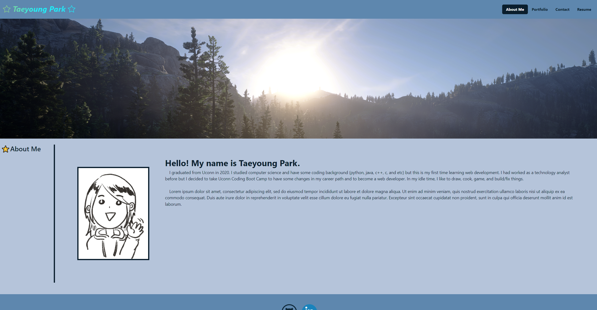
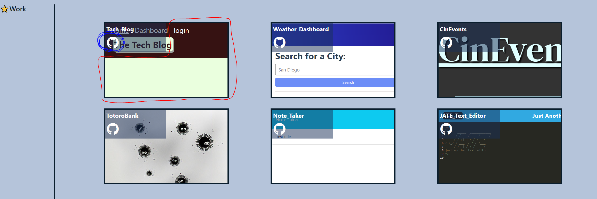

# React Portfolio

## Task and Description

This is portfoilo that is modified from https://taeyoungp.github.io/Module2_Challenge/ and built using REACT.js.

The purpose of this portfolio is not only for applying jobs but also to share works with other developers and collaborate on projects.

## User Story

```md
AS AN employer looking for candidates with experience building single-page applications
I WANT to view a potential employee's deployed React portfolio of work samples
SO THAT I can assess whether they're a good candidate for an open position
```

## Description and Guide
* [Link to Deployed Application](https://taeyoungp.github.io/Portfolio_react/)

* Homepage (About Me)
    

* To see the works on the portfolio page, click part inside of red line for deployed application & GitHub icon for respective Github repository. 
    


## Credits
* React.js
* For creating animated radient text: https://web.dev/speedy-css-tip-animated-gradient-text/
* Color palette used for this portfolio: https://coolors.co/0a1e2d-1c3955-205384-5e87ae-b5c4da

- - -
© 2023 edX Boot Camps LLC. Confidential and Proprietary. All Rights Reserved.
